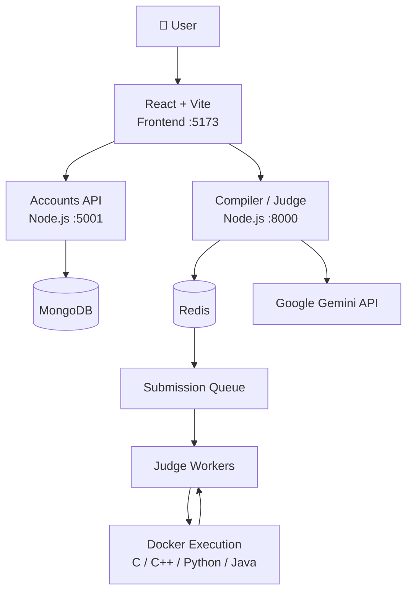
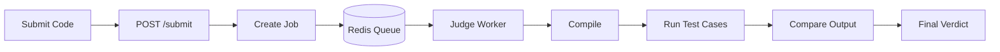
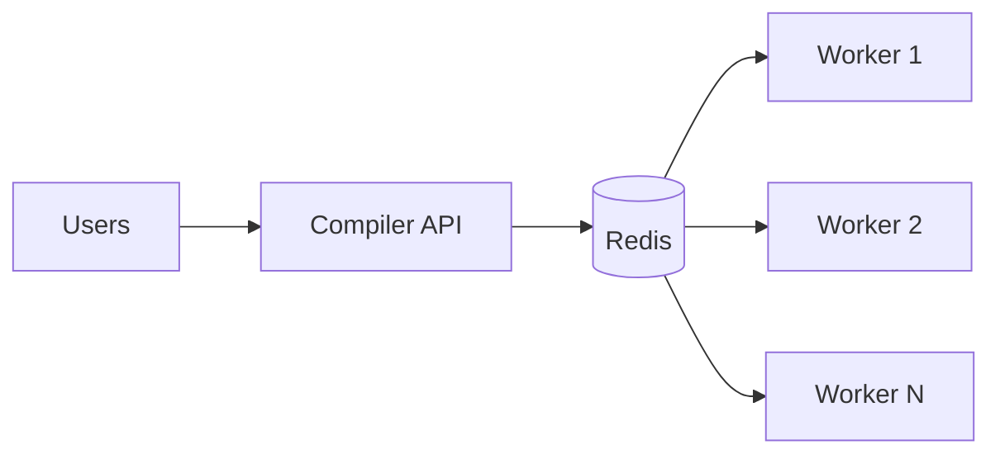
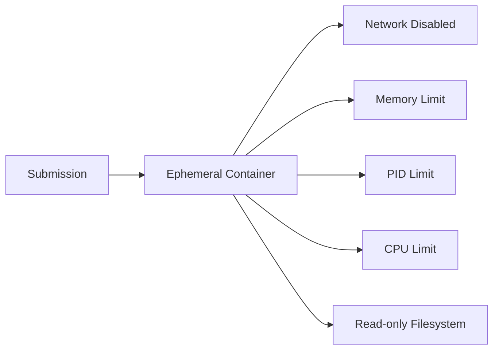
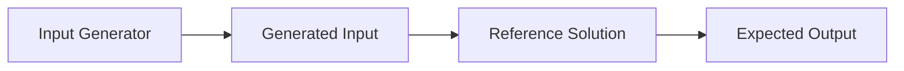
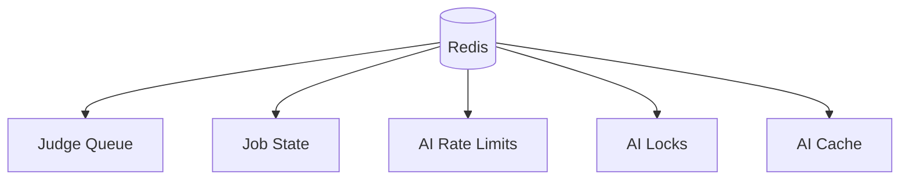
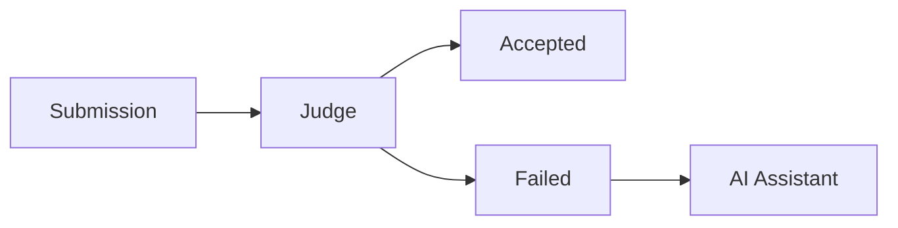
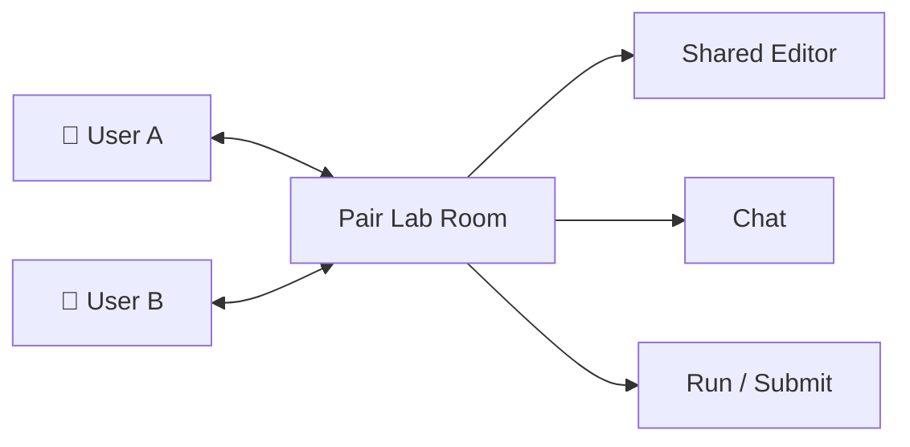
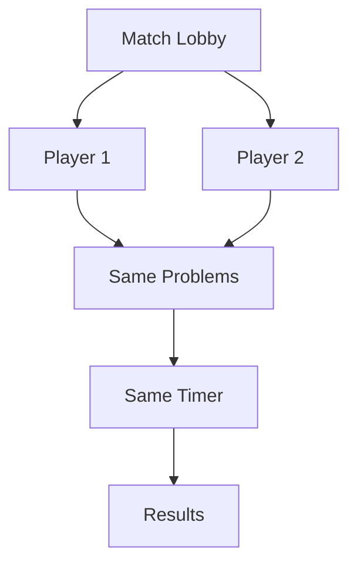
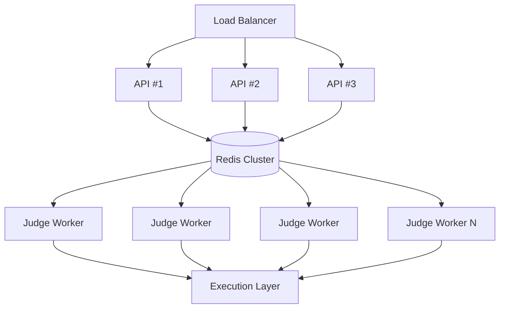

# ⚡ ZYOSEE — Online Judge

<p align="center">
  <b>Practice. Compile. Compete. Improve.</b>
</p>

<p align="center">
  A full-stack competitive programming platform for solving problems,
  compiling code, competing with friends, collaborating in real time,
  and learning with AI.
</p>

<p align="center">
  
  
  
  
  
  
</p>

---

## 📖 Table of Contents

- [About](#-about)
- [Features](#-features)
- [Architecture](#-architecture)
- [Project Structure](#-project-structure)
- [Tech Stack](#-tech-stack)
- [Getting Started](#-getting-started)
- [Authentication](#-authentication)
- [Online Compiler](#-online-compiler)
- [Online Judge](#-online-judge)
- [Submission Queue](#-submission-queue)
- [Judge Workers](#-judge-workers)
- [Docker Execution](#-docker-execution)
- [Problem Management](#-problem-management)
- [Test Generation](#-test-generation)
- [Redis](#-redis)
- [AI Features](#-ai-features)
- [Pair Lab](#-pair-lab)
- [Duel Arena](#-duel-arena)
- [Progress Tracking](#-progress-tracking)
- [Security](#-security)
- [Failure Handling](#-failure-handling)
- [Scalability](#-scalability)
- [API Reference](#-api-reference)
- [Limitations](#-current-limitations)
- [Roadmap](#-roadmap)
- [Development Commands](#-development-commands)
- [Design Principles](#-design-principles)

---

# 🎯 About

**ZYOSEE** is a full-stack Online Judge and competitive programming platform designed to combine:

- Problem solving
- Online compilation
- Hidden-test judging
- Code execution
- AI-assisted debugging
- Complexity analysis
- Real-time collaboration
- Competitive coding duels
- User progress tracking

The system separates **authentication**, **code execution**, **problem management**, **AI services**, and **judge workers** into independent components.

This separation prevents CPU-heavy or potentially unsafe submitted programs from directly affecting authentication and other core application services.

---

# ✨ Features

| Feature | Description |
|---|---|
| 🔐 Authentication | JWT-based authentication and authorization |
| 💻 Online Compiler | Compile and execute C, C++, Python and Java |
| 🧪 Online Judge | Hidden test-case based evaluation |
| 🐳 Docker Execution | Containerized execution environment |
| ⚡ Async Submissions | Redis-backed submission queue |
| 👷 Judge Workers | Multiple workers process submissions concurrently |
| 🤖 AI Assistant | Gemini-powered debugging assistant |
| 🧠 Complexity Analysis | AI-based time-complexity analysis |
| 🚦 AI Rate Limiting | Cooldowns, quotas, locks and caching |
| 🤝 Pair Lab | Collaborative problem-solving rooms |
| ⚔️ Duel Arena | Timed competitive coding matches |
| 📊 Progress | Submission-based user statistics |
| 📝 Drafts | Per-user local code drafts |
| 🛡️ Authorization | Server-side permission enforcement |
| 📦 Problem Management | MongoDB-backed problem management |
| 🔄 Redis Fallback | In-memory fallback when Redis is unavailable |

---

# 🏗️ Architecture

## High-Level Architecture



---

## Why Two Main Services?

ZYOSEE intentionally separates the Accounts API from the Compiler/Judge service.

```text
                 ┌─────────────────────┐
                 │      Frontend       │
                 └──────────┬──────────┘
                            │
             ┌──────────────┴──────────────┐
             │                             │
             ▼                             ▼
      ┌──────────────┐             ┌──────────────┐
      │ Accounts API │             │ Compiler/OJ  │
      │    :5001     │             │    :8000     │
      └──────────────┘             └──────────────┘
             │                             │
             ▼                             ▼
          MongoDB                        Redis
                                           │
                                           ▼
                                      Judge Workers
```

A submitted program can consume CPU, memory or execution time.

Keeping execution separate prevents a heavy submission from directly taking down authentication endpoints.

---

# 📁 Project Structure

```text
ZYOSEE/
│
├── backend/
│   ├── controllers/
│   ├── middleware/
│   ├── models/
│   ├── routes/
│   ├── config/
│   └── server.js
│
├── compiler/
│   ├── routes/
│   ├── workers/
│   ├── judge/
│   ├── ai/
│   ├── problems/
│   ├── testdata/
│   ├── Dockerfile
│   └── server.js
│
├── frontend/
│   ├── src/
│   ├── components/
│   ├── pages/
│   ├── starters.js
│   └── main.jsx
│
├── scripts/
│   ├── generate-tests.js
│   └── migrate-problems-to-mongo.js
│
└── README.md
```

---

# 🛠️ Tech Stack

| Layer | Technology |
|---|---|
| Frontend | React |
| Build Tool | Vite |
| Styling | Tailwind CSS |
| Backend | Node.js |
| API | REST |
| Authentication | JWT |
| Database | MongoDB |
| Queue | Redis |
| Cache | Redis |
| Execution | Docker |
| AI | Google Gemini |
| Languages | C, C++, Python, Java |
| Package Manager | npm |

---

# 🚀 Getting Started

## Prerequisites

Make sure the following are installed:

- Node.js
- npm
- MongoDB
- Docker
- Redis

---

## 1. Clone the Repository

```bash
git clone <your-repository-url>
cd ZYOSEE
```

---

## 2. Configure Environment Variables

Each service contains an environment template.

```bash
cp backend/.env.sample backend/.env
cp compiler/.env.sample compiler/.env
cp frontend/.env.sample frontend/.env
```

### JWT Secret

The JWT secret must be **exactly identical** in both services.

```env
# backend/.env
JWT_SECRET_KEY=your-secret
```

```env
# compiler/.env
JWT_SECRET_KEY=your-secret
```

### MongoDB

Make sure:

```env
DB_NAME=your_database
```

matches the database specified by:

```env
MONGODB_URI=...
```

---

# ▶️ Running the Application

Open three terminals.

## Backend

```bash
cd backend
npm install
npm run dev
```

Runs on:

```text
http://localhost:5001
```

---

## Compiler

```bash
cd compiler
npm install
npm run dev
```

Runs on:

```text
http://localhost:8000
```

---

## Frontend

```bash
cd frontend
npm install
npm run dev
```

Runs on:

```text
http://localhost:5173
```

---

# 🔐 Authentication

ZYOSEE uses JWT-based authentication.

## Accounts API

| Method | Endpoint | Auth | Description |
|---|---|---:|---|
| `POST` | `/signup` | ❌ | Create an account |
| `POST` | `/login` | ❌ | Login |
| `GET` | `/me` | ✅ | Get current user |
| `GET` | `/users` | ❌ | List users |
| `GET` | `/users/:id` | ❌ | Get user |
| `PUT` | `/users/:id` | ✅ | Update own account |
| `DELETE` | `/users/:id` | ✅ | Delete own account |

Protected requests use:

```http
Authorization: Bearer <token>
```

Tokens expire after one hour by default.

---

# 🔄 Session Expiration

ZYOSEE handles expired sessions in three ways.

### 1. Page-load validation

Stored tokens are checked before being used.

### 2. Automatic expiration timer

A timer fires when the token reaches its expiration time.

### 3. Server rejection

Any:

```text
401 Unauthorized
403 Forbidden
```

response clears the session.

This also handles cases where a token is rejected after a server restart or secret change.

---

# 💻 Online Compiler

ZYOSEE supports:

```text
C
C++
Python
Java
```

## Run API

```http
POST /run
```

### Request

```json
{
  "language": "cpp",
  "code": "#include <iostream>\n...",
  "input": "10 20"
}
```

### Verdicts

| Verdict | Meaning |
|---|---|
| `success` | Program exited successfully |
| `compilation_error` | Compilation failed |
| `runtime_error` | Program crashed or exited abnormally |
| `time_limit_exceeded` | Execution exceeded the time limit |
| `output_limit_exceeded` | Program exceeded the output limit |

Compilation and execution times are returned separately.

```json
{
  "compileMs": 280,
  "runMs": 8
}
```

This avoids treating compiler startup time as program execution time.

---

# 🧪 Online Judge

The official submission flow is:



---

## Submission API

```http
POST /submit
```

### Request

```json
{
  "slug": "two-sum",
  "language": "cpp",
  "code": "..."
}
```

### Response

```json
{
  "jobId": "abc123",
  "status": "queued",
  "waitingAhead": 2
}
```

The browser then polls:

```http
GET /submit/:jobId
```

### Job States

```text
queued
running
done
failed
```

---

# ⚡ Submission Queue

Instead of executing every submission directly inside the HTTP request, ZYOSEE places submissions into Redis.



This prevents a large number of simultaneous submissions from creating uncontrolled compiler processes.

---

# 👷 Judge Workers

The number of concurrent judge jobs is controlled by the number of workers.

For example:

```bash
docker compose up -d --scale worker=3
```

creates three judge workers.

```text
Redis Queue
    │
    ├── Worker 1
    ├── Worker 2
    └── Worker 3
```

This makes judge capacity independently scalable.

---

# 📊 Queue Performance

A simple concurrency test produced the following measurements:

| Workers | First Accepted | All Jobs Completed |
|---:|---:|---:|
| 1 | ~618 ms | ~38.0 s |
| 3 | ~613 ms | ~16.5 s |

The first accepted submission remains nearly unchanged because submission is primarily a queue operation.

Increasing worker count reduces total queue completion time.

---

# 📍 Queue Position

The queue uses:

```text
oj:judge:queue
```

Jobs are inserted and consumed using:

```text
LPUSH
BRPOP
```

`LPOS` is used to calculate how many jobs are ahead of a submission.

The queue therefore provides an exact `waitingAhead` value rather than simply returning the total queue length.

---

# 🧠 Judge Correctness

A submission is accepted only when:

```text
passed === total
```

This is important because a run can terminate before all tests are reached.

### Supported Verdicts

```text
accepted
wrong_answer
compilation_error
runtime_error
time_limit_exceeded
output_limit_exceeded
```

Example:

```text
Test 1   ✓
Test 2   ✓
Test 3   ✓
Test 4   ✗
Test 5   ✓

Result: WRONG ANSWER
```

---

# 🧪 Test Case Architecture

Problems use:

```text
problem/
│
├── problem.json
│
└── tests/
    ├── 1.in
    ├── 1.out
    ├── 2.in
    ├── 2.out
    └── ...
```

The first two tests are samples.

The remaining tests are hidden.

```text
                 Client
                   │
          ┌────────┴────────┐
          ▼                 ▼
      Sample 1           Sample 2


                 Server
                   │
          ┌────────┼────────┐
          ▼        ▼        ▼
       Hidden 3 Hidden 4 Hidden N
```

Hidden inputs and expected outputs never reach the browser.

---

# 🔒 Output Comparison

The judge uses normalized output comparison.

It:

- removes trailing whitespace
- removes blank lines from the end
- preserves internal spacing
- compares normalized output

This prevents correct programs from failing because of insignificant trailing whitespace.

---

# 🧩 Custom Test Cases

Custom testing is intentionally separated from official judging.

## Custom Run

```http
POST /run-batch
```

Example:

```json
{
  "slug": "two-sum",
  "language": "cpp",
  "code": "...",
  "cases": [
    {
      "input": "2 7",
      "expected": "9"
    }
  ]
}
```

Custom testing:

- compiles once
- runs multiple cases
- optionally compares expected output
- never generates an official verdict

## Official Submission

```http
POST /submit
```

uses the problem's own test suite.

This prevents custom user-created cases from producing an official `Accepted` result.

---

# 🐳 Docker Execution

The compiler and judge are containerized.

```text
┌─────────────────────────────────────┐
│            Docker Container         │
│                                     │
│  Compiler / Judge                   │
│  ├── Node.js                        │
│  ├── g++                            │
│  ├── Python                         │
│  └── Java                           │
│                                     │
│       Submitted Program             │
│              │                      │
│              ▼                      │
│         Compile / Run               │
│                                     │
└─────────────────────────────────────┘
```

### Build

```bash
cd compiler
npm run docker:build
```

### Start

```bash
npm run docker:start
```

### Logs

```bash
npm run docker:logs
```

### Stop

```bash
npm run docker:stop
```

---

# 📦 Runtime Problem Mount

Problems are mounted separately:

```bash
-v "$(pwd)/problems:/app/problems:ro"
```

The Docker image contains the execution engine.

The mounted directory contains problem data.

### Benefits

- New problems do not require rebuilding the image
- Hidden tests remain outside the image
- Problem content can change independently
- Submitted programs cannot modify test files
- The mount is read-only

---

# 🛡️ Sandbox Model

The current Docker setup provides:

- isolated filesystem
- unprivileged execution
- read-only problem files
- separation from the main application

However, it is not yet a fully hardened public sandbox.

### Current Limitations

- Network access remains available
- Memory limits are not yet enforced
- Process limits are not yet enforced
- Multiple submissions share the execution container
- A new container is not created for every submission

### Planned Hardened Sandbox



---

# 🗄️ Database Architecture

MongoDB stores persistent application data.

```text
MongoDB
│
├── Users
│
├── Problems
│   ├── Statement
│   ├── Constraints
│   ├── Examples
│   ├── Reference Solution
│   ├── Generator Specification
│   └── Test Manifest
│
└── Future
    └── Submissions
```

Actual test files are stored separately on disk.

### Why?

MongoDB documents have a 16 MB size limit, while generated problem test data can become several megabytes.

Therefore:

```text
MongoDB
└── Metadata + Test Manifest

Disk
└── Actual .in / .out Files
```

---

# 📝 Problem Management

Problems are created through the **Add Problem** page.

Only accounts included in:

```env
ADMIN_EMAILS=you@example.com
```

can access the administrative problem APIs.

Authorization is enforced on the server for every admin request.

> Hiding the admin button in the frontend is not treated as a security mechanism.

---

# 🧪 Reference Solutions

Every problem requires a trusted reference solution.



The reference solution defines the expected output.

This allows expected outputs to be generated automatically for large test suites.

---

# 🧰 Test Generation

Tests can be generated using:

```bash
node scripts/generate-tests.js
```

The generator is deterministic.

The same seed produces the same:

```text
Inputs
Outputs
Files
```

---

## Curated Tests

Used for cases such as:

- Minimum values
- Maximum values
- Duplicate values
- Negative values
- Overflow risks
- Special edge cases

---

## Generated Tests

Generated cases gradually increase toward the problem's maximum constraints.

This helps expose algorithms that pass small examples but fail at scale.

---

# 📐 Input Generator

Supported field types:

| Type | Description |
|---|---|
| Single Integer | Integer within a range |
| Integer Array | Array with configurable length |
| Sum of K Values | Generates a reachable target |

Example:

```text
n = 5
a = [1, 4, 7, 9, 12]
target = 13
```

The target can be generated from actual elements of the array rather than being chosen randomly.

---

# ⏱️ Language Time Limits

ZYOSEE applies language-specific multipliers.

| Language | Multiplier |
|---|---:|
| C | `1×` |
| C++ | `1×` |
| Java | `2×` |
| Python | `3×` |

This provides reasonable execution budgets across compiled and interpreted languages.

---

# 📤 Output Limits

Output limits are derived from the reference solution.

```text
Maximum Reference Output
          │
          ▼
         × 2
          │
          ▼
     Problem Limit
```

Limits:

```text
Minimum: 64 KB
Maximum: 8 MB
```

The same output limit is used for:

```text
Reference Solution
       ↓
User Submission
```

This ensures that a correct reference solution can satisfy the same output constraints imposed on users.

---

# ⚡ Redis

Redis is used by two independent systems.



Redis is not required for the core compiler to operate.

---

# 🔑 Redis Keys

| Key | Type | Purpose |
|---|---|---|
| `oj:ai:hist:<userId>` | Sorted Set | Sliding-window quota |
| `oj:ai:lock:<userId>` | String | One active AI request |
| `oj:ai:ans:<sha256>` | String | Cached AI response |
| `oj:judge:queue` | List | Submission queue |
| `oj:judge:job:<id>` | String | Job state and verdict |

---

# 🔐 Atomic AI Lock

AI concurrency uses:

```text
SET key value NX EX 60
```

`NX` guarantees that only one request can claim the lock.

The expiration prevents a crashed request from permanently locking the user.

```text
Request A ──► SET NX ──► SUCCESS

Request B ──► SET NX ──► FAIL
```

The second request receives:

```http
429 Too Many Requests
```

---

# 📴 Redis Failure Handling

If Redis becomes unavailable, ZYOSEE falls back to in-memory storage.

```text
Redis Available
      │
      ▼
 Redis Mode


Redis Unavailable
      │
      ▼
 Memory Mode
```

The application does not indefinitely wait for Redis to reconnect.

This prevents Redis failures from turning optional infrastructure into a permanently hanging request.

---

# 🤖 AI Features

ZYOSEE contains two major AI capabilities:

1. **Coding Assistant**
2. **Time Complexity Analysis**

Both use a shared Gemini integration.

---

# 🧠 AI Coding Assistant

The assistant is activated after a failed submission or failed custom test.



The assistant is not involved in judging.

If Gemini is unavailable, judging continues normally.

---

## Assistant Actions

| Action | Purpose |
|---|---|
| Explain Error | Explain what went wrong |
| Hint | Provide progressive guidance |
| Ask | Ask questions about the code |
| Full Solution | Return a complete solution after explicit request |

### Hint Levels

```text
Level 1 → Conceptual hint
Level 2 → Problem region
Level 3 → Specific mistake
Level 4 → Small code fragment
```

Hidden test inputs and expected outputs are never sent to the AI.

---

# 🧠 Time Complexity Analysis

After judging, the AI can analyze the submitted code and provide:

```text
Best Case
Average Case
Worst Case
```

The analysis is separate from the judge.

```text
Judge
 │
 ├── Correctness
 │
 └── Verdict
       │
       ▼
 Complexity Analysis
       │
       ▼
 Gemini
```

---

# 🚦 AI Rate Limiting

Every AI request passes through multiple controls.

```text
Request
   │
   ▼
Concurrent Lock
   │
   ▼
Cache
   │
   ▼
Cooldown
   │
   ▼
Hourly / Daily Quota
   │
   ▼
Gemini
```

### Default Configuration

| Setting | Default |
|---|---:|
| Requests / hour | `10` |
| Requests / day | `30` |
| Cooldown | `5 seconds` |
| Cache TTL | `30 minutes` |
| Normal output | `700 tokens` |
| Full solution output | `1600 tokens` |
| Maximum code | `8000 characters` |

---

# 🤝 Pair Lab

**Pair Lab** allows two users to solve the same problem collaboratively.



### Features

- Shared editor
- Live cursor indicators
- Chat
- Shared problem
- Run
- Submit
- Friend-based invitations

The goal is to support collaborative learning without requiring users to leave the platform.

---

# ⚔️ Duel Arena

Duel Arena provides timed coding matches.



### Modes

```text
Random Duel
Custom Duel

First Accepted
Best Score
Best Time
Best of 3
```

The server remains authoritative for:

- Match state
- Timer
- Problem assignment
- Results

---

# 📊 Progress Tracking

User progress is derived from actual platform activity rather than self-reported values.

Possible statistics include:

- Total problems
- Solved problems
- Attempted problems
- Easy solved
- Medium solved
- Hard solved
- Acceptance rate
- Current streak
- Average attempts
- Average solve time
- Topic performance
- Duel rating
- Pair Lab activity

Example:

```text
┌─────────────────────────────┐
│       YOUR PROGRESS         │
├─────────────────────────────┤
│ Problems Solved      128    │
│ Acceptance Rate      74%    │
│ Current Streak       12 d   │
│ Average Attempts     1.8    │
│ Duel Rating          1223   │
└─────────────────────────────┘
```

---

# 📝 Per-User Drafts

Editor drafts are stored locally using:

```text
oj_draft:<userId>:<slug>:<language>
```

Example:

```text
oj_draft:user123:two-sum:cpp
```

The user ID is part of the key so different accounts cannot accidentally share unfinished code on the same browser.

### Logout

Logging out clears browser drafts.

### Token Expiration

Token expiration does not clear drafts because the same user may simply sign in again.

---

# 🧱 Starter Code

Starter templates are stored in:

```text
frontend/src/starters.js
```

Priority:

```text
Problem-specific starter
        │
        ▼
Default starter
```

Problem-specific starter code takes precedence.

### Java

Java submissions must use:

```java
public class Main
```

because the judge compiles:

```text
Main.java
```

and runs:

```bash
java -cp <directory> Main
```

---

# 🌐 API Reference

## Accounts

| Method | Endpoint | Description |
|---|---|---|
| `POST` | `/signup` | Create account |
| `POST` | `/login` | Login |
| `GET` | `/me` | Current user |
| `GET` | `/users` | List users |
| `GET` | `/users/:id` | Get user |
| `PUT` | `/users/:id` | Update account |
| `DELETE` | `/users/:id` | Delete account |

---

## Compiler

| Method | Endpoint | Description |
|---|---|---|
| `POST` | `/run` | Compile and run code |
| `POST` | `/run-batch` | Run custom test cases |
| `POST` | `/submit` | Submit to official judge |
| `GET` | `/submit/:jobId` | Get submission status |

---

## Problems

| Method | Endpoint | Description |
|---|---|---|
| `GET` | `/problems` | List problems |
| `GET` | `/problems/:slug` | Get problem |
| `POST` | `/admin/problems` | Create problem |

---

# 📈 Scalability

One of the core design principles of ZYOSEE is:

> **API scalability is independent from judge scalability.**

## Current Architecture

```text
                API
                 │
                 ▼
            Redis Queue
                 │
          ┌──────┴──────┐
          ▼             ▼
       Worker         Worker
```

## Scaled Architecture



This allows additional workers to be added without scaling the frontend or authentication service.

---

# 🧯 Failure Handling

ZYOSEE is designed to degrade gracefully.

| Failure | Behaviour |
|---|---|
| Redis unavailable | In-memory fallback |
| Gemini unavailable | Judge continues |
| Gemini quota exhausted | AI becomes unavailable |
| Token expired | Session cleared |
| MongoDB unavailable | Requests fail after timeout |
| Worker unavailable | Pending queue jobs remain |
| Problem directory missing | Compiler can still operate |
| AI cache unavailable | New AI request can proceed |

---

# 🌐 MongoDB Resilience

MongoDB connection handling includes:

- Connection retry
- Safe client initialization
- Explicit connection timeout
- DNS/SRV failure handling
- Recovery after failed connection attempts
- Protection against unhandled background connection errors

Configured timeout:

```env
MONGO_SERVER_SELECTION_TIMEOUT_MS=8000
```

This prevents database failures from making the application appear permanently frozen.

---

# 🔒 Security

## Secrets

Secrets are never intended to be baked into Docker images.

```text
.env
 │
 └── Runtime configuration

.dockerignore
 │
 └── Prevents .env from entering image layers
```

---

## Hidden Tests

```text
Browser
 │
 ├── Sample Input
 └── Sample Output


Server
 │
 ├── Hidden Input
 └── Expected Output
```

Hidden test data remains server-side.

---

## Server-Side Authorization

Frontend:

```text
Controls visibility
```

Backend:

```text
Controls permission
```

The backend independently validates protected operations.

---

## AI Protection

AI limits are enforced server-side.

Frontend buttons are only UX controls and are not considered security mechanisms.

---

# ⚠️ Current Limitations

ZYOSEE is currently designed as a strong development and educational Online Judge architecture rather than a fully hardened public execution platform.

### Known limitations

- Public arbitrary-code execution requires stronger sandboxing
- Network access is not completely disabled
- Memory limits are not yet enforced
- Process limits are not yet enforced
- Multiple submissions currently share the execution container
- Submission history is not yet persisted
- Redis is currently used as the queue rather than a full HA queue cluster
- Pair Lab requires additional conflict-resolution hardening for very large deployments

These limitations are intentionally documented as part of the architecture.

---

# 🛣️ Roadmap

## Phase 1 — Core Platform

- [x] Authentication
- [x] User management
- [x] Online compiler
- [x] C / C++ / Python / Java
- [x] Problem management
- [x] Test-case judging
- [x] Hidden tests
- [x] Docker execution
- [x] Redis queue
- [x] Judge workers

---

## Phase 2 — Competitive Platform

- [x] Pair Lab
- [x] Duel Arena
- [x] Progress tracking
- [ ] Submission history
- [ ] Leaderboards
- [ ] Ratings
- [ ] Contest system

---

## Phase 3 — Production Execution

- [ ] One container per submission
- [ ] `--network none`
- [ ] CPU limits
- [ ] Memory limits
- [ ] PID limits
- [ ] Read-only root filesystem
- [ ] Ephemeral execution environments
- [ ] Worker health monitoring
- [ ] Automatic failed-job recovery

---

## Phase 4 — Scale

- [ ] Load balancer
- [ ] Multiple API instances
- [ ] Dedicated judge cluster
- [ ] Redis HA
- [ ] MongoDB replica set
- [ ] Metrics and observability
- [ ] Distributed tracing
- [ ] Centralized logging

---

# 🧪 Development Commands

### Generate Test Cases

```bash
node scripts/generate-tests.js
```

### Migrate Problems

```bash
node scripts/migrate-problems-to-mongo.js
```

### Build Docker Image

```bash
cd compiler
npm run docker:build
```

### Start Docker Services

```bash
npm run docker:start
```

### View Logs

```bash
npm run docker:logs
```

### Redis CLI

```bash
npm run redis:cli
```

### Stop Services

```bash
npm run docker:stop
```

---

# 🧭 Design Principles

ZYOSEE follows several architectural principles.

### 1. Separate Authentication from Code Execution

User authentication should never share execution resources with arbitrary submitted programs.

### 2. Keep Judging Independent from AI

The judge must determine correctness without depending on a language model.

### 3. Keep Hidden Tests Server-Side

A hidden test is only useful if the client cannot access it.

### 4. Queue Expensive Work

Compilation and execution should be controlled through a queue and worker pool.

### 5. Keep Secrets Outside Images

Environment-specific credentials belong in runtime configuration.

### 6. Make the Server Authoritative

Permissions, match state, judging and other sensitive operations must be validated server-side.

### 7. Fail Gracefully

Optional services such as Redis and Gemini should not unnecessarily take down core functionality.

### 8. Scale Independently

Web/API capacity and judge capacity should be independently scalable.

---

# 📚 Reference

The initial compiler implementation was based on:

```text
AlgoU-Online-Compiler-main
```

It is used only as a reference implementation and is not wired into the current ZYOSEE system.

---

# 👨‍💻 Author

<p align="center">
  <b>Soumyadeep De</b>
</p>

<p align="center">
  Computer Science & Engineering
</p>

---

# ⭐ ZYOSEE

<p align="center">
  <b>Practice.</b> &nbsp;
  <b>Compile.</b> &nbsp;
  <b>Compete.</b> &nbsp;
  <b>Improve.</b>
</p>

<p align="center">
  Built to explore how a modern competitive programming platform works —
  from authentication and problem management to asynchronous judging,
  isolated execution, scalable workers, real-time collaboration,
  competitive matches, and AI-assisted learning.
</p>

<p align="center">
  <sub>⚡ ZYOSEE — Code. Think. Compete.</sub>
</p>
